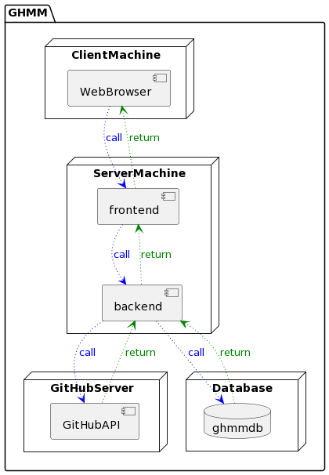
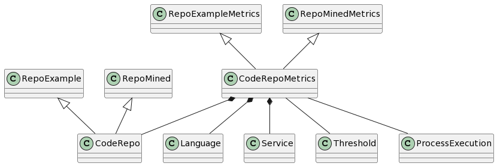

# GitHub Microservice Mining Tool

This project aims to assist Software Engineering practitioners finding microservice applications at scale.
The search and classification of code repositories is based on a study which gathered microservices characteristics from the literature and built an algorithm which makes classification decisions based on a score and some other factors.
You can find out more about this study here: 

## Architecture & Technologies
The tool was built following a monolithic architecture using the Model-View-Controller design pattern for simplicity.
The programming language of choice was [Java 17](https://www.jcp.org/en/jsr/detail?id=392) and the framework used was [Spring Boot](https://start.spring.io/) for the Models and Controllers, whereas [Thymeleaf](https://www.thymeleaf.org/) as the template engine for the views.
Below the system architecture with its main nodes and components: 


## Model
The image below shows a UML class diagram with the data model of the system: 


## Run Locally

Package the .war file with the command
```bash
./mvnw  package -DskipTests
```
And then run it with:
```bash
java -jar target/ghmm-0.0.1-SNAPSHOT.war
```
You can open the app at [localhost](http://localhost:8080/)

Additionally, the embedded H2 database can be accessed at [/h2-console](http://localhost:8080/h2-console/) with the following credentials:\
JDBC URL: jdbc:h2:file:./data/ghmmdb \
User Name: sa \
Password: ghmmd@$$

Here you can see what it should look like: [Views of the system](views.md)