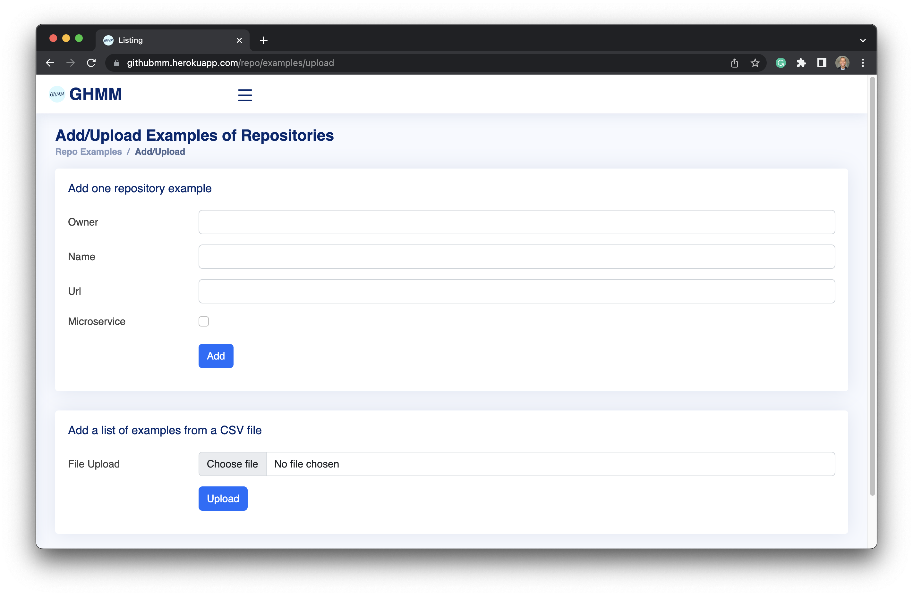

# Use Case Descriptions And Views of the application

1.  Maintain RepoExample: As Software Engineer, I want to add, list, or
    remove RepoExamples.  
    **Scenario**: Add one repo example - the view is shown on
    <a href="#fig:addUploadExamples" data-reference-type="ref"
    data-reference="fig:addUploadExamples">[fig:addUploadExamples]</a>

    1.  \- On the main menu, click on Repo Examples \> Add/Upload.

    2.  \- Type the owner of the code repository in the field Owner.

    3.  \- Type the name of the code repository in the field Name.

    4.  \- Type the Url of the code repository in the field Url.

    5.  \- Click on the checkbox Microservice if the entered repository
        is an MSA.

    6.  \- Click on the button Add.

    **Precondition**: N/A.  
    **Post-condition**: The repository example is saved in the
    database.  
    **Scenario**: Add a list of repo examples - the view is shown on
    <a href="#fig:addUploadExamples" data-reference-type="ref"
    data-reference="fig:addUploadExamples">[fig:addUploadExamples]</a>
    and the sequence diagram on
    <a href="#fig:UploadRepoExamples" data-reference-type="ref"
    data-reference="fig:UploadRepoExamples">[fig:UploadRepoExamples]</a>

    1.  \- On the main menu, click on Repo Examples \> Add/Upload.

    2.  \- Click on Choose file.

    3.  \- Select the CSV file.

    4.  \- Click on Upload.

    **Precondition**: The user has a CSV file in the format of this
    [example](https://github.com/domingospanta/ghmm/blob/main/data/sample/microservices.csv)[1]containing
    the repositories to be added.  
    **Post-condition**: The list of repository examples are saved in the
    database.  
    **Scenario**: List repo examples - the view is shown on
    <a href="#fig:listExamples" data-reference-type="ref"
    data-reference="fig:listExamples">[fig:listExamples]</a>

    1.  \- On the main menu, click on Repo Examples \> List Examples.

    2.  \- Click on Page Size to choose how many repositories you want
        to see per page.

    3.  \- The list of repositories is shown.

    **Precondition**: There have been repositories examples added
    previously to the system.  
    **Post-condition**: The repository examples present in the database
    is listed to the user and can be filtered by name, owner, or URL.  
    **Scenario**: Remove repo example - the view is shown on
    <a href="#fig:listExamples" data-reference-type="ref"
    data-reference="fig:listExamples">[fig:listExamples]</a>

    1.  \- On the main menu, click on Repo Examples \> List Examples.

    2.  \- Click on Page Size to choose how many repositories you want
        to see per page.

    3.  \- On the left side of each line, click on the archive icon to
        delete the line.

    **Precondition**: There have been repositories examples added
    previously to the system.  
    **Post-condition**: The repository example is removed from the
    database.

2.  Process RepoExample Metrics: As Software Engineer, I want to process
    RepoExample Metrics.  
    **Scenario**: Start RepoExamples Metrics Processing - the view is
    shown on
    <a href="#fig:processExampleMetrics" data-reference-type="ref"
    data-reference="fig:processExampleMetrics">[fig:processExampleMetrics]</a>
    and the implementation details on sequence diagrams illustrated by
    <a href="#fig:StartMetricsGeneration" data-reference-type="ref"
    data-reference="fig:StartMetricsGeneration">[fig:StartMetricsGeneration]</a>
    and
    <a href="#fig:ExecuteMetricsOperations" data-reference-type="ref"
    data-reference="fig:ExecuteMetricsOperations">[fig:ExecuteMetricsOperations]</a>

    1.  \- On the main menu, click on Repo Examples \> Process Metrics.

    2.  \- Click on the Start button.

    **Precondition**: There have been repositories examples added
    previously to the system.  
    **Post-condition**: The system fetched data about the repositories
    on to generate their metrics.

3.  List/Review RepoExample Metrics: As Software Engineer, I want to
    list the generated RepoExample metrics.  
    **Scenario**: List RepoExample Metrics - the view is shown on
    <a href="#fig:listExamplesMetrics" data-reference-type="ref"
    data-reference="fig:listExamplesMetrics">[fig:listExamplesMetrics]</a>

    1.  \- On the main menu, click on Repo Examples \> List Metrics.

    2.  \- Click on Page Size to choose how many repositories you want
        to see per page.

    **Precondition**: The RepoExamples Metrics have been previously
    processed.  
    **Post-condition**: The repository examples metrics present in the
    database are listed to the user and can be filtered by name, owner,
    or URL.

4.  View RepoExample Metrics Statistics: As Software Engineer, I want to
    view statistical data about the generated metrics.  
    **Scenario**: Show RepoExample Metrics Statistics - the view is
    shown on <a href="#fig:metricsStats" data-reference-type="ref"
    data-reference="fig:metricsStats">[fig:metricsStats]</a>

    1.  \- On the main menu, click on Repo Examples \> Metrics
        Statistics.

    **Precondition**: The RepoExamples Metrics have been previously
    processed.  
    **Post-condition**: Statistics about MSAs and monoliths are shown.

5.  Search/Upload MinedRepo: As Software Engineer, I want to upload a
    list of MinedRepos (unclassified repositories) or search them
    through API.  
    **Scenario**: Search MinedRepo - the view is shown on
    <a href="#fig:searchUploadMinedRepos" data-reference-type="ref"
    data-reference="fig:searchUploadMinedRepos">[fig:searchUploadMinedRepos]</a>

    1.  \- On the main menu, click on Identification \> Search/Upload.

    2.  \- Type the search term on the field Search String according to
        API search query[2].

    3.  \- On the field Programming Languages, hold down the control key
        and click on the desired programming languages for the search.

    4.  \- On the field Quantity, type the number of code repositories
        you want to find.

    5.  \- Click on the Clear current list checkbox if you want to erase
        any previous search/upload.

    6.  \- Click on Search.

    **Precondition**: N/A  
    **Post-condition**: The desired quantity of code repositories is
    searched on and saved to the database.  
    **Scenario**: Upload MinedRepo - the view is shown on
    <a href="#fig:searchUploadMinedRepos" data-reference-type="ref"
    data-reference="fig:searchUploadMinedRepos">[fig:searchUploadMinedRepos]</a>

    1.  \- On the main menu, click on Identification \> Search/Upload.

    2.  \- Click on Choose file.

    3.  \- Select the CSV file.

    4.  \- Click on Upload.

    **Precondition**: The user has a CSV file in the format of this
    [example](https://github.com/domingospanta/ghmm/blob/main/data/sample/mined_microservices.csv)[3]
    containing the mined repositories to be added.  
    **Post-condition**: The list of mined repositories is saved in the
    database.

6.  Process MinedRepo Metrics: As Software Engineer, I want to process
    MinedRepo Metrics.  
    **Scenario**: Start MinedRepos Metrics Processing - the view is
    shown on
    <a href="#fig:processMinedRepoMetrics" data-reference-type="ref"
    data-reference="fig:processMinedRepoMetrics">[fig:processMinedRepoMetrics]</a>

    1.  \- On the main menu, click on Identification \> Process Metrics.

    2.  \- Click on the Start button.

    **Precondition**: There have been mined repositories added
    previously to the system.  
    **Post-condition**: The system fetched data about the repositories
    on to generate their metrics.

7.  List/Review MinedRepo Metrics: As Software Engineer, I want to list
    the generated MinedRepo metrics.  
    **Scenario**: List MinedRepo Metrics - the view is shown on
    <a href="#fig:listMinedReposMetrics" data-reference-type="ref"
    data-reference="fig:listMinedReposMetrics">[fig:listMinedReposMetrics]</a>

    1.  \- On the main menu, click on Identification \> List Metrics.

    2.  \- Click on Page Size to choose how many repositories you want
        to see per page.

    **Precondition**: The MinedRepos Metrics have been previously
    processed.  
    **Post-condition**: The repository examples metrics present in the
    database are listed to the user and can be filtered by name, owner,
    or URL.

8.  List/Filter Classified MinedRepos: As Software Engineer, I want to
    list and/or filter classified MinedRepos.  
    **Scenario**: Show Classified MinedRepos - the view is shown on
    <a href="#fig:listMinedRepos" data-reference-type="ref"
    data-reference="fig:listMinedRepos">[fig:listMinedRepos]</a>

    1.  \- On the main menu, click on Corpus \> Mined Repos.

    2.  \- Click on Page Size to choose how many mined repositories you
        want to see per page.

    **Precondition**: The MinedRepos Metrics have been previously
    processed.  
    **Post-condition**: The mined repositories present in the database
    are listed to the user with their respective classification and can
    be filtered by name, owner, or URL.

[1] https://github.com/domingospanta/ghmm/blob/main/data/sample/microservices.csv

[2] https://docs.github.com/en/rest/search?apiVersion=2022-11-28#search-repositories

[3] https://github.com/domingospanta/ghmm/blob/main/data/sample/mined_microservices.csv